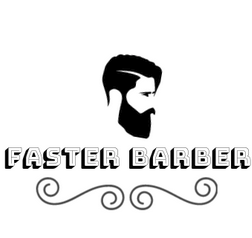

# Usando o app Faster Barber

## `Objetivo`

A principal função da aplicação é servir como uma fila virtual para barbearias, tornando o movimento do negócio previsível para o profissional e tornando o serviço mais eficiência para o consumidor.

Pela aplicação é possível agendar um corte com antecedência no horário mais pertinente para o consumidor. Assim, tornando desnecessário a espera em filas presenciais para consumir o serviço.

## `Para iniciar a aplicação`

### **_npm start_**

Roda a aplicação no modo de desenvolvimento.
Entre na url [http://localhost:3000](http://localhost:3000) para visualizar no seu browser

### **_Acesso_**

A aplicação possui a funcionalidade de cadastramento, mas é possível entrar como como convidado através do user a seguir:

email: convidado@gmail.com \
senha: 12345

## `Utilização`

~~gif here~~
